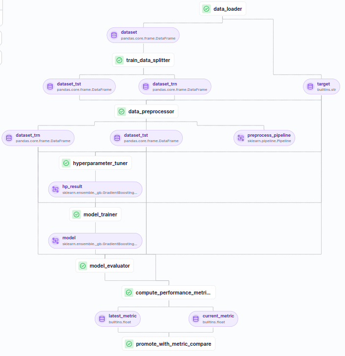

# e2e-iris
This project showcases an end-to-end machine learning project. It makes use of the the [ZenML](https://www.zenml.io/) machine learning 
oprations (MLOps) structure to develop both the model steps
and pipelines. A classification model is trained on the [iris dataset](https://en.wikipedia.org/wiki/Iris_flower_data_set) and its entire life cycle is monitored via the MLFlow model tracking. The model is deployed locally using the MLFlow deployment service. An interactive dashboard  is built using the [shiny](https://shiny.posit.co/py/) python framework to showcase batch prediction while the MLFlow deployment service daemon is running locally.




## Set up
1. Clone the repository by running
    ```
    git clone https://github.com/Rasheed19/e2e-iris.git
    ```
1. Navigate to the root folder, i.e., `e2e-iris` and create a python virtual environment by running
    ```
    python3 -m venv .venv
    source .venv/bin/activate
    ``` 
1. Prepare all modules and ZenML stacks by running
    ```
    make setup
    make install-stack-local
    ```
    Because `zenml==0.58.0` and `shiny==0.10.2` depends on different version of `click`, install `shiny==0.10.2` independently of the `requirements.txt` by running
    ```
    pip install shiny==0.10.2
    ```
    You will see some warning from `pip` but can be ignored and does not affect the running of the pipelines and app.
1. Run the model training pipeline by running
    ```
    python run.py
    ```
    Note that you can configure the training pipeline with some options. To see the list of all available options, run
    ```
    python run.py --help
    ```
    You can see and interact with the run artifacts by starting the ZenML dashboard via 
    ```
    zenml up
    ```
1. If you are happy with the model performance, run the deployment pipeline via
   ```
    python run.py --only-deployment
    ```
    This will deploy the best and latest model registered in the model registory as an MLFlow Deplyment Service which will run locally.

1. To use the running deployment service for prediction in an interactive app, start the shiny app by running 
    ```
    shiny run app.py --port PORT_NUMBER
    ```  
    where `PORT_NUMBER` is the port at which you want the app to run. Note that the ZenML server and MLFlow model deployment service run at 8237 and 8000 respectively, thus you might need to use a port different to these.
    
## What next
The next project, based on this, will be to run the ZenML stacks (both the training and deployment) on a remote server such as the GCP or AWS. One of the benefits of using the ZenML framework is that it allows you to play around your ideas locally without worrying about cloud cost, and when you are ready to deploy to a remote server, you will not need to change your written codes to conform with your platform of choice. All what you will need to do is to change the flavour of your stacks from local to remote. Check the [ZenML website](https://www.zenml.io/) to read more about its benefits and set up.